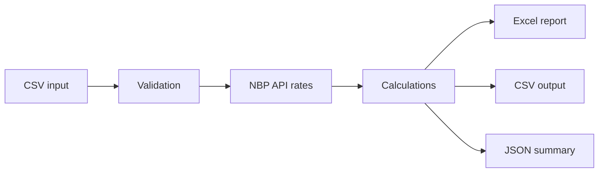

# Invoice Report Automation

A portfolio project that automates a small but realistic business process:
validating invoice data, converting values to PLN and generating consistent
reports.

The project was created for a junior automation / AI role. It demonstrates
Python fundamentals, tabular data processing, CSV and JSON handling, API
integration, error handling, testing, documentation and a simple web interface.

> Live demo: the public Streamlit link will be added after deployment.

## Business problem

Invoice data often arrives in spreadsheets or CSV files and must be checked
before it can be used in a report. Manual checks are repetitive and easy to
perform inconsistently.

This automation:

1. Reads invoice data from CSV.
2. Normalizes text, dates and numeric fields.
3. Finds missing values, duplicates and invalid business data.
4. Retrieves current NBP table A exchange rates through a public API.
5. Converts valid invoice totals to PLN.
6. Marks unpaid and overdue invoices.
7. Produces Excel, CSV and JSON reports.



## Main features

- Required-column validation.
- Duplicate invoice detection.
- Date, amount, VAT, currency and payment-status checks.
- Current EUR, USD, GBP and CHF rates from the official NBP Web API.
- Clearly labelled offline fallback rates for a reliable demonstration.
- VAT, gross value and PLN conversion calculations.
- Overdue-invoice detection for a selected reporting date.
- Excel workbook with seven structured sheets.
- Processed CSV, JSON summary, validation-issues CSV and execution log.
- Command-line interface for batch processing.
- Streamlit interface for a no-install browser demo.
- Unit tests and a GitHub Actions workflow.

## Technology

- Python 3.12
- pandas
- openpyxl
- Streamlit
- Python `unittest`
- NBP Web API
- GitHub Actions

## Project structure

```text
invoice-report-automation/
├── app.py                         # Streamlit web interface
├── cli.py                         # command-line interface
├── config.json                    # validation and fallback settings
├── data/sample_invoices.csv       # fictional demonstration data
├── src/invoice_automation/
│   ├── config.py
│   ├── exchange_rates.py
│   ├── pipeline.py
│   ├── reporting.py
│   └── validation.py
├── tests/                         # automated unit tests
├── .github/workflows/tests.yml    # continuous integration
├── LEARNING_GUIDE_PL.md
└── requirements.txt
```

## Run the batch automation

Create and activate a virtual environment, then install the dependencies:

```bash
python -m venv .venv
python -m pip install -r requirements.txt
```

Run the deterministic offline demonstration:

```bash
python cli.py --offline --as-of 2026-07-30 --output output/demo
```

Run with current NBP exchange rates:

```bash
python cli.py --as-of 2026-07-30 --output output/live
```

Run the web interface:

```bash
streamlit run app.py
```

## Input columns

| Column | Meaning | Example |
|---|---|---|
| `invoice_id` | Unique invoice identifier | `FV-2026-001` |
| `client_name` | Client or company name | `Alfa Consulting` |
| `issue_date` | Invoice issue date | `2026-06-01` |
| `due_date` | Payment due date | `2026-06-15` |
| `currency` | Supported ISO currency code | `PLN`, `EUR`, `USD` |
| `net_amount` | Positive net value | `1200.00` |
| `vat_rate` | Supported VAT percentage | `0`, `5`, `8`, `23` |
| `payment_status` | Payment state | `paid` or `unpaid` |

The included sample deliberately contains invalid records so that the
validation workflow is visible.

## Generated files

| File | Purpose |
|---|---|
| `invoice_report.xlsx` | Formatted workbook with summaries and detailed data |
| `processed_invoices.csv` | Normalized data with validation and calculations |
| `summary_report.json` | Machine-readable result for another system or API |
| `validation_issues.csv` | Review queue containing detected data problems |
| `run.log` | Short execution summary and warnings |

## Tests

Run all tests with the Python standard library:

```bash
python -m unittest discover -s tests -v
```

The tests cover:

- validation errors and missing columns,
- parsing an NBP API response,
- exchange-rate calculations,
- overdue-invoice logic,
- Excel workbook structure,
- JSON report generation.

## Reliability and limitations

- Uploaded or sample data is not sent to a database.
- The built-in data is fictional.
- If the NBP API is unavailable, the application continues with visibly
  labelled demonstration rates.
- This educational project uses current exchange rates. It is not an
  accounting system and must not be used to prepare statutory tax records.
- A production version would add authentication, persistent storage,
  historical accounting rates and organization-specific business rules.

## AI-assisted development

The project uses an AI-assisted learning workflow: AI supports architecture,
implementation ideas, debugging and documentation, while requirements,
business rules, test results and final behaviour are reviewed by the author.
The goal is not only to generate code, but to understand, test and explain it.

## Data source

Exchange rates are retrieved with HTTPS GET requests from the official
[NBP Web API](https://api.nbp.pl/).

## Author

Piotr Piela

